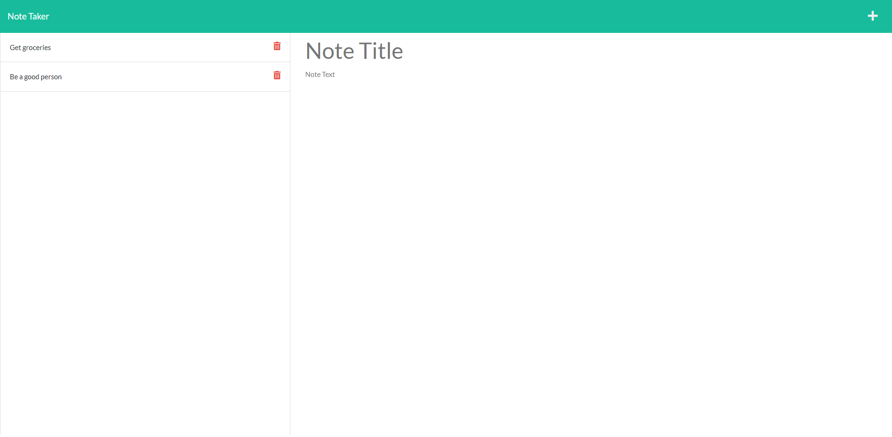

# Note-Taker

## Table of Contents
<ol>
  <li><a href="#description">Description</a></li> 
<li><a href="#license">License</a></li>
  <li><a href="#installation">Installation</a></li>
  <li><a href="#usage">Usage</a></li>
  <li><a href="#contributors">Contributors</a></li>
  <li><a href="#testing">Testing</a></li>
  <li><a href="#questions">Questions</a></li>

</ol>

## Description
It allows a user to enter notes that are persistent (saved to the server) and view their previously saved notes. It also allows the user to delete notes no longer desired

    
## License
**MIT** - A short and simple permissive license with conditions only requiring preservation of copyright and license notices. Licensed works, modifications, and larger works may be distributed under different terms and without source code. 

  [MIT License Information](https://github.com/git/git-scm.com/blob/main/MIT-LICENSE.txt)
## Installation
[Download the files from the repo](https://github.com/Stiltskinner/Note-Taker)

Open the terminal in this folder and type npm install

## Usage
Open the webpage while the server is running, click Get Started, and then enter any notes you'd like.

## Contributors
Danny Yates [GitHub- cycoconuts](https://github.com/cycoconutz/) collaborated with me in discord as we worked on our own projects.

## Testing
Try it out!

## Questions
Author: [Stiltskinner](https://github.com/Stiltskinner)

You can reach me with any questions at my email: [ryan.thomas@utexas.edu](mailto:ryan.thomas@utexas.edu)
